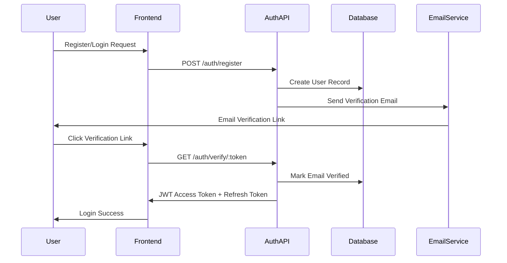

# Peer Academy - Authentication & Role Management System

## Overview

The authentication and role management system is the foundation of the Peer Academy platform, supporting complex hierarchical governance with merit-based access controls. The system must handle dynamic role assignment, weighted permissions, and integration with the scoring algorithms.

## Authentication Architecture

### Multi-Factor Authentication Flow


### JWT Token Structure
```typescript
interface JWTPayload {
  sub: string; // user ID
  email: string;
  roles: RoleAssignment[];
  permissions: string[];
  votingWeights: VotingWeight[];
  settlementId?: string;
  iat: number;
  exp: number;
}

interface RoleAssignment {
  roleId: string;
  roleName: string;
  scope: 'academy' | 'subject' | 'settlement';
  scopeId?: string;
  assignedAt: Date;
  expiresAt?: Date;
}

interface VotingWeight {
  context: 'subject' | 'colloquium' | 'settlement';
  contextId: string;
  weight: number;
  lastUpdated: Date;
}
```

## Role Hierarchy System

### Core Role Types

#### 1. Academy Level Roles
- **Director**: Elected leader with emergency powers and rule creation authority
- **Colloquium Member**: Representative from each subject area
- **Academy Member**: Basic platform access

#### 2. Subject Level Roles  
- **Subject Head**: Elected leader of a subject area
- **Representative**: Colloquium representative for the subject
- **Active Member**: Participating member with voting rights
- **Observer**: Read-only access to subject activities

#### 3. Settlement Level Roles
- **Settlement Founder**: Creator and initial leader of a settlement
- **Settlement Director**: Current elected leader
- **Resident**: Full member living in the settlement
- **Visitor**: Temporary access to settlement activities

### Dynamic Role Assignment Logic

```typescript
class RoleManager {
  // Automatically assign roles based on performance metrics
  async updateUserRoles(userId: string): Promise<void> {
    const user = await this.getUserWithScores(userId);
    
    // Update subject-level roles
    for (const membership of user.subjectMemberships) {
      await this.updateSubjectRoles(user, membership);
    }
    
    // Update academy-level roles
    await this.updateAcademyRoles(user);
    
    // Update settlement roles
    if (user.settlementId) {
      await this.updateSettlementRoles(user);
    }
  }
  
  private async updateSubjectRoles(user: User, membership: SubjectMembership): Promise<void> {
    const subject = await this.getSubject(membership.subjectId);
    const allMembers = subject.members.sort((a, b) => b.cumulativeScore - a.cumulativeScore);
    
    // Top scorer becomes representative (if not already director)
    if (allMembers[0].userId === user.id && !user.roles.some(r => r.roleName === 'director')) {
      await this.assignRole(user.id, 'representative', 'subject', subject.id);
    }
    
    // Top 10% become active members with enhanced voting weight
    const topThreshold = Math.ceil(allMembers.length * 0.1);
    if (allMembers.slice(0, topThreshold).some(m => m.userId === user.id)) {
      await this.assignRole(user.id, 'active_member', 'subject', subject.id);
    }
  }
  
  private async updateAcademyRoles(user: User): Promise<void> {
    // Director selection based on highest overall score
    const allUsers = await this.getAllUsersWithScores();
    const topUser = allUsers.sort((a, b) => b.totalScore - a.totalScore)[0];
    
    if (topUser.id === user.id) {
      await this.assignRole(user.id, 'director', 'academy');
    }
    
    // Colloquium members are subject representatives
    const isRepresentative = user.roles.some(r => 
      r.roleName === 'representative' && r.scope === 'subject'
    );
    
    if (isRepresentative) {
      await this.assignRole(user.id, 'colloquium_member', 'academy');
    }
  }
}
```

## Permission System

### Granular Permissions
```typescript
enum Permission {
  // Content Permissions
  CREATE_PRESENTATION = 'create:presentation',
  EVALUATE_PRESENTATION = 'evaluate:presentation',
  VIEW_PRESENTATION = 'view:presentation',
  MONETIZE_CONTENT = 'monetize:content',
  
  // Governance Permissions
  VOTE_ON_RULES = 'vote:rules',
  CREATE_RULES = 'create:rules',
  VETO_RULES = 'veto:rules',
  VIEW_GOVERNANCE = 'view:governance',
  
  // Philosophy Permissions
  CREATE_PROPOSITION = 'create:proposition',
  VOTE_PROPOSITION = 'vote:proposition',
  REVIEW_LOGIC = 'review:logic',
  
  // Administrative Permissions
  MANAGE_SUBJECTS = 'manage:subjects',
  MANAGE_USERS = 'manage:users',
  MANAGE_SETTLEMENTS = 'manage:settlements',
  VIEW_ANALYTICS = 'view:analytics',
  
  // Emergency Permissions (Director only)
  EMERGENCY_POWERS = 'emergency:powers',
  OVERRIDE_VOTES = 'override:votes',
}

interface RolePermissions {
  [key: string]: {
    permissions: Permission[];
    conditions?: PermissionCondition[];
  };
}

interface PermissionCondition {
  type: 'score_threshold' | 'time_limit' | 'context_specific';
  value: any;
  message: string;
}

const ROLE_PERMISSIONS: RolePermissions = {
  director: {
    permissions: [
      Permission.CREATE_RULES,
      Permission.VETO_RULES,
      Permission.EMERGENCY_POWERS,
      Permission.OVERRIDE_VOTES,
      Permission.MANAGE_SETTLEMENTS,
      Permission.VIEW_ANALYTICS
    ],
    conditions: [
      {
        type: 'score_threshold',
        value: 1000,
        message: 'Director must maintain minimum score of 1000'
      }
    ]
  },
  
  colloquium_member: {
    permissions: [
      Permission.VOTE_ON_RULES,
      Permission.VIEW_GOVERNANCE,
      Permission.REVIEW_LOGIC
    ]
  },
  
  representative: {
    permissions: [
      Permission.CREATE_PROPOSITION,
      Permission.VOTE_PROPOSITION,
      Permission.VOTE_ON_RULES
    ]
  },
  
  subject_head: {
    permissions: [
      Permission.MANAGE_SUBJECTS,
      Permission.CREATE_RULES,
      Permission.VIEW_ANALYTICS
    ]
  },
  
  active_member: {
    permissions: [
      Permission.CREATE_PRESENTATION,
      Permission.EVALUATE_PRESENTATION,
      Permission.VOTE_PROPOSITION,
      Permission.MONETIZE_CONTENT
    ]
  },
  
  observer: {
    permissions: [
      Permission.VIEW_PRESENTATION,
      Permission.VIEW_GOVERNANCE
    ]
  }
};
```

### Context-Aware Authorization

```typescript
class AuthorizationService {
  async checkPermission(
    userId: string, 
    permission: Permission, 
    context?: AuthContext
  ): Promise<boolean> {
    const user = await this.getUser(userId);
    
    // Check if user has any role with this permission
    const hasPermission = user.roles.some(role => 
      this.roleHasPermission(role, permission)
    );
    
    if (!hasPermission) return false;
    
    // Check context-specific conditions
    if (context) {
      return await this.checkContextConditions(user, permission, context);
    }
    
    return true;
  }
  
  private async checkContextConditions(
    user: User, 
    permission: Permission, 
    context: AuthContext
  ): Promise<boolean> {
    switch (context.type) {
      case 'subject':
        return this.checkSubjectPermission(user, permission, context.subjectId);
      case 'settlement':
        return this.checkSettlementPermission(user, permission, context.settlementId);
      case 'presentation':
        return this.checkPresentationPermission(user, permission, context.presentationId);
      default:
        return true;
    }
  }
  
  private async checkSubjectPermission(
    user: User, 
    permission: Permission, 
    subjectId: string
  ): Promise<boolean> {
    const membership = user.subjectMemberships.find(m => m.subjectId === subjectId);
    
    if (!membership) return false;
    
    // Check if user meets minimum score requirements for certain permissions
    if (permission === Permission.CREATE_PROPOSITION && membership.cumulativeScore < 100) {
      return false;
    }
    
    // Check voting weight thresholds
    if (permission === Permission.VOTE_ON_RULES && membership.cumulativeScore < 50) {
      return false;
    }
    
    return true;
  }
}

interface AuthContext {
  type: 'subject' | 'settlement' | 'presentation' | 'rule' | 'proposition';
  subjectId?: string;
  settlementId?: string;
  presentationId?: string;
  ruleId?: string;
  propositionId?: string;
}
```

## Security Implementation

### Password Security
```typescript
class PasswordService {
  private readonly SALT_ROUNDS = 12;
  private readonly MIN_PASSWORD_LENGTH = 12;
  
  async hashPassword(password: string): Promise<string> {
    this.validatePassword(password);
    return bcrypt.hash(password, this.SALT_ROUNDS);
  }
  
  async verifyPassword(password: string, hash: string): Promise<boolean> {
    return bcrypt.compare(password, hash);
  }
  
  private validatePassword(password: string): void {
    if (password.length < this.MIN_PASSWORD_LENGTH) {
      throw new Error('Password must be at least 12 characters long');
    }
    
    const hasUppercase = /[A-Z]/.test(password);
    const hasLowercase = /[a-z]/.test(password);
    const hasNumbers = /\d/.test(password);
    const hasSpecialChar = /[!@#$%^&*(),.?":{}|<>]/.test(password);
    
    if (!hasUppercase || !hasLowercase || !hasNumbers || !hasSpecialChar) {
      throw new Error('Password must contain uppercase, lowercase, numbers, and special characters');
    }
  }
}
```

### Session Management
```typescript
class SessionManager {
  private readonly ACCESS_TOKEN_EXPIRY = '15m';
  private readonly REFRESH_TOKEN_EXPIRY = '7d';
  private readonly MAX_SESSIONS_PER_USER = 5;
  
  async createSession(user: User): Promise<TokenPair> {
    // Clean up old sessions
    await this.cleanupUserSessions(user.id);
    
    const accessToken = jwt.sign(
      await this.buildJWTPayload(user),
      process.env.JWT_SECRET!,
      { expiresIn: this.ACCESS_TOKEN_EXPIRY }
    );
    
    const refreshToken = jwt.sign(
      { sub: user.id, type: 'refresh' },
      process.env.REFRESH_SECRET!,
      { expiresIn: this.REFRESH_TOKEN_EXPIRY }
    );
    
    // Store refresh token in database
    await this.storeRefreshToken(user.id, refreshToken);
    
    return { accessToken, refreshToken };
  }
  
  async refreshSession(refreshToken: string): Promise<TokenPair> {
    const payload = jwt.verify(refreshToken, process.env.REFRESH_SECRET!) as any;
    
    if (!await this.isValidRefreshToken(payload.sub, refreshToken)) {
      throw new Error('Invalid refresh token');
    }
    
    const user = await this.getUser(payload.sub);
    return this.createSession(user);
  }
}

interface TokenPair {
  accessToken: string;
  refreshToken: string;
}
```

### API Rate Limiting & Security

```typescript
class SecurityMiddleware {
  // Rate limiting by user role and endpoint sensitivity
  static createRateLimit(
    windowMs: number = 15 * 60 * 1000, // 15 minutes
    maxRequests: number = 100
  ) {
    return rateLimit({
      windowMs,
      max: maxRequests,
      keyGenerator: (req) => {
        const user = req.user as User;
        // Higher limits for higher-scoring users
        const scoreMultiplier = Math.min(2, 1 + (user.totalScore / 1000));
        return `${user.id}:${Math.floor(maxRequests * scoreMultiplier)}`;
      },
      message: 'Too many requests, please try again later'
    });
  }
  
  // Validate API access based on user context
  static async validateAPIAccess(req: Request, res: Response, next: NextFunction) {
    const user = req.user as User;
    const endpoint = req.route.path;
    
    // Check if user account is in good standing
    if (user.status === 'suspended') {
      return res.status(403).json({ error: 'Account suspended' });
    }
    
    // Check if accessing sensitive endpoints requires higher scores
    const sensitiveEndpoints = ['/governance/', '/philosophy/', '/settlements/'];
    const isSensitive = sensitiveEndpoints.some(se => endpoint.includes(se));
    
    if (isSensitive && user.totalScore < 50) {
      return res.status(403).json({ 
        error: 'Insufficient reputation to access this resource' 
      });
    }
    
    next();
  }
}
```

## Integration with Scoring System

### Real-time Role Updates
```typescript
class RoleUpdateService {
  constructor(
    private eventEmitter: EventEmitter,
    private socketService: SocketService
  ) {
    // Listen for score changes
    this.eventEmitter.on('score:updated', this.handleScoreUpdate.bind(this));
  }
  
  private async handleScoreUpdate(event: ScoreUpdateEvent): Promise<void> {
    const user = await this.getUser(event.userId);
    const oldRoles = [...user.roles];
    
    // Update roles based on new scores
    await this.roleManager.updateUserRoles(event.userId);
    
    const newRoles = await this.getUserRoles(event.userId);
    
    // Notify user of role changes
    const roleChanges = this.compareRoles(oldRoles, newRoles);
    if (roleChanges.length > 0) {
      this.socketService.emitToUser(event.userId, 'roles:updated', {
        changes: roleChanges,
        newPermissions: await this.getUserPermissions(event.userId)
      });
      
      // Update JWT token in client
      const newTokens = await this.sessionManager.createSession(user);
      this.socketService.emitToUser(event.userId, 'auth:refresh', newTokens);
    }
  }
  
  private compareRoles(oldRoles: Role[], newRoles: Role[]): RoleChange[] {
    const changes: RoleChange[] = [];
    
    // Find new roles
    newRoles.forEach(newRole => {
      if (!oldRoles.find(r => r.id === newRole.id)) {
        changes.push({
          type: 'added',
          role: newRole,
          message: `You've been assigned the role: ${newRole.name}`
        });
      }
    });
    
    // Find removed roles
    oldRoles.forEach(oldRole => {
      if (!newRoles.find(r => r.id === oldRole.id)) {
        changes.push({
          type: 'removed',
          role: oldRole,
          message: `Role removed: ${oldRole.name}`
        });
      }
    });
    
    return changes;
  }
}

interface RoleChange {
  type: 'added' | 'removed';
  role: Role;
  message: string;
}
```

## Database Schema

### Core Tables
```sql
-- Users table with authentication data
CREATE TABLE users (
  id UUID PRIMARY KEY DEFAULT gen_random_uuid(),
  email VARCHAR(255) UNIQUE NOT NULL,
  password_hash VARCHAR(255) NOT NULL,
  email_verified BOOLEAN DEFAULT FALSE,
  status VARCHAR(20) DEFAULT 'active', -- active, suspended, inactive
  total_score INTEGER DEFAULT 0,
  created_at TIMESTAMP DEFAULT CURRENT_TIMESTAMP,
  updated_at TIMESTAMP DEFAULT CURRENT_TIMESTAMP
);

-- User profiles
CREATE TABLE user_profiles (
  user_id UUID PRIMARY KEY REFERENCES users(id) ON DELETE CASCADE,
  first_name VARCHAR(100) NOT NULL,
  last_name VARCHAR(100) NOT NULL,
  bio TEXT,
  avatar_url VARCHAR(500),
  location VARCHAR(255),
  settlement_id UUID REFERENCES settlements(id),
  created_at TIMESTAMP DEFAULT CURRENT_TIMESTAMP,
  updated_at TIMESTAMP DEFAULT CURRENT_TIMESTAMP
);

-- Roles and permissions
CREATE TABLE roles (
  id UUID PRIMARY KEY DEFAULT gen_random_uuid(),
  name VARCHAR(100) NOT NULL,
  description TEXT,
  scope VARCHAR(20) NOT NULL, -- academy, subject, settlement
  permissions JSONB NOT NULL,
  created_at TIMESTAMP DEFAULT CURRENT_TIMESTAMP
);

CREATE TABLE user_roles (
  id UUID PRIMARY KEY DEFAULT gen_random_uuid(),
  user_id UUID REFERENCES users(id) ON DELETE CASCADE,
  role_id UUID REFERENCES roles(id) ON DELETE CASCADE,
  scope_id UUID, -- subject_id or settlement_id based on scope
  assigned_at TIMESTAMP DEFAULT CURRENT_TIMESTAMP,
  expires_at TIMESTAMP,
  assigned_by UUID REFERENCES users(id)
);

-- Sessions and tokens
CREATE TABLE refresh_tokens (
  id UUID PRIMARY KEY DEFAULT gen_random_uuid(),
  user_id UUID REFERENCES users(id) ON DELETE CASCADE,
  token_hash VARCHAR(255) NOT NULL,
  expires_at TIMESTAMP NOT NULL,
  created_at TIMESTAMP DEFAULT CURRENT_TIMESTAMP,
  last_used TIMESTAMP
);

CREATE INDEX idx_users_email ON users(email);
CREATE INDEX idx_user_roles_user_id ON user_roles(user_id);
CREATE INDEX idx_refresh_tokens_user_id ON refresh_tokens(user_id);
CREATE INDEX idx_users_total_score ON users(total_score DESC);
```

This authentication and role management system provides the secure, merit-based foundation needed for the complex governance structure of Peer Academy, with dynamic role assignment, weighted permissions, and integration with the scoring algorithms.