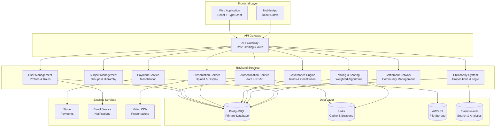

# Peer Academy Platform - Technical Architecture Plan

## Executive Summary

The Peer Academy platform is a sophisticated educational and governance system that combines meritocratic evaluation, dynamic rule evolution, and philosophical consensus-building across interconnected settlements. This architecture supports complex hierarchical governance, weighted voting systems, and real-time collaboration.

## Recommended Technology Stack

### Backend Architecture
- **Runtime**: Node.js with TypeScript (type safety for complex governance logic)
- **Framework**: Express.js with middleware for authentication and validation
- **Database**: PostgreSQL (ACID compliance critical for voting/governance integrity)
- **Caching**: Redis (session management, real-time data)
- **Real-time**: Socket.io (live voting, presentations, discussions)
- **File Storage**: AWS S3 (presentation videos, documents)
- **Search**: Elasticsearch (proposition search, content discovery)

### Frontend Architecture  
- **Framework**: React 18 with TypeScript
- **State Management**: Redux Toolkit (complex state for governance)
- **UI Library**: Material-UI or Tailwind CSS
- **Real-time Client**: Socket.io client
- **Video Player**: Video.js or React Player
- **Charts/Analytics**: D3.js or Recharts (scoring visualizations)

### Infrastructure & DevOps
- **Containerization**: Docker with multi-stage builds
- **Orchestration**: Kubernetes (horizontal scaling)
- **CI/CD**: GitHub Actions or GitLab CI
- **Monitoring**: Prometheus + Grafana
- **Logging**: ELK Stack (Elasticsearch, Logstash, Kibana)
- **Cloud Provider**: AWS (scalability and service ecosystem)

### Security & Authentication
- **Authentication**: JWT with refresh tokens
- **Authorization**: Role-Based Access Control (RBAC)
- **API Security**: Rate limiting, CORS, helmet.js
- **Data Encryption**: AES-256 for sensitive data
- **HTTPS**: TLS 1.3 with certificate auto-renewal

### Payment & Monetization
- **Payment Processing**: Stripe (course sales, donations)
- **Subscription Management**: Stripe Billing
- **Analytics**: Custom analytics + Google Analytics
- **Content Delivery**: CloudFront CDN

## System Architecture Overview



## Core Data Models

### User & Authentication
```typescript
interface User {
  id: string;
  email: string;
  passwordHash: string;
  profile: UserProfile;
  roles: Role[];
  subjects: SubjectMembership[];
  totalScore: number;
  createdAt: Date;
  updatedAt: Date;
}

interface UserProfile {
  firstName: string;
  lastName: string;
  bio?: string;
  avatar?: string;
  location?: string;
  settlementId?: string;
}

interface Role {
  id: string;
  name: string; // 'member', 'subject_head', 'representative', 'director'
  permissions: string[];
  subjectId?: string; // null for academy-wide roles
}
```

### Subject & Hierarchy System
```typescript
interface Subject {
  id: string;
  name: string;
  description: string;
  parentSubjectId?: string; // for hierarchical subjects
  settlementId?: string;
  constitution: SubjectConstitution;
  members: SubjectMembership[];
  headId?: string; // current subject head
  representativeId?: string; // colloquium representative
  createdAt: Date;
}

interface SubjectMembership {
  userId: string;
  subjectId: string;
  joinedAt: Date;
  cumulativeScore: number;
  weeklyScores: WeeklyScore[];
  isActive: boolean;
}

interface WeeklyScore {
  week: number;
  year: number;
  presentationId?: string;
  score: number;
  votingWeight: number; // based on cumulative score
}
```

### Presentation & Evaluation System
```typescript
interface Presentation {
  id: string;
  title: string;
  description: string;
  presenterId: string;
  subjectId: string;
  weekNumber: number;
  year: number;
  contentType: 'video' | 'document' | 'slides';
  fileUrl: string;
  thumbnailUrl?: string;
  duration?: number; // for videos
  evaluations: PresentationEvaluation[];
  totalScore: number;
  isPublic: boolean;
  monetizable: boolean;
  createdAt: Date;
}

interface PresentationEvaluation {
  id: string;
  presentationId: string;
  evaluatorId: string;
  score: number; // 1-10 scale
  feedback?: string;
  votingWeight: number; // evaluator's weight at time of vote
  createdAt: Date;
}
```

### Governance & Rules System
```typescript
interface Constitution {
  id: string;
  scopeType: 'academy' | 'subject';
  scopeId: string;
  rules: Rule[];
  version: number;
  createdAt: Date;
}

interface Rule {
  id: string;
  title: string;
  description: string;
  value: number; // strength/importance (0-100)
  category: string;
  createdBy: string; // userId
  votes: RuleVote[];
  isActive: boolean;
  createdAt: Date;
}

interface RuleVote {
  id: string;
  ruleId: string;
  voterId: string;
  voteType: 'strengthen' | 'weaken' | 'remove';
  votingWeight: number;
  cycle: number;
  createdAt: Date;
}

interface Colloquium {
  id: string;
  members: ColloguiumMember[];
  currentDirectorId?: string;
  currentCycle: number;
  decisions: ColloguiumDecision[];
}

interface ColloguiumMember {
  userId: string;
  subjectId: string;
  votingWeight: number;
  joinedCycle: number;
}
```

### Philosophy & Proposition System
```typescript
interface PhilosophyBranch {
  id: string;
  name: string;
  description: string;
  subjects: string[]; // subject IDs
  propositions: Proposition[];
}

interface Proposition {
  id: string;
  branchId: string;
  subjectId: string;
  title: string;
  statement: string;
  evidence: string;
  value: number; // strength (0-100)
  votes: PropositionVote[];
  dependencies: string[]; // other proposition IDs
  conflicts: string[]; // conflicting proposition IDs
  status: 'active' | 'under_review' | 'rejected';
  createdBy: string;
  createdAt: Date;
}

interface PropositionVote {
  id: string;
  propositionId: string;
  voterId: string;
  voteType: 'support' | 'oppose' | 'strengthen' | 'weaken';
  votingWeight: number;
  reasoning?: string;
  createdAt: Date;
}

interface LogicCheck {
  id: string;
  propositionIds: string[];
  checkType: 'consistency' | 'contradiction' | 'dependency';
  result: 'pass' | 'fail';
  details: string;
  resolvedAt?: Date;
}
```

### Settlement & Network System
```typescript
interface Settlement {
  id: string;
  name: string;
  description: string;
  founderId: string;
  directorId?: string;
  subjects: string[]; // subject IDs in this settlement
  location: SettlementLocation;
  constitution: Constitution;
  funding: SettlementFunding;
  members: SettlementMembership[];
  status: 'planned' | 'founding' | 'active';
  createdAt: Date;
}

interface SettlementLocation {
  address?: string;
  city: string;
  region: string;
  country: string;
  coordinates?: {
    latitude: number;
    longitude: number;
  };
}

interface SettlementMembership {
  userId: string;
  settlementId: string;
  role: 'resident' | 'visitor' | 'founder';
  joinedAt: Date;
}
```

### Monetization System
```typescript
interface Course {
  id: string;
  title: string;
  description: string;
  instructorId: string;
  subjectId: string;
  presentations: string[]; // presentation IDs
  price: number;
  currency: string;
  enrollments: CourseEnrollment[];
  revenue: number;
  isActive: boolean;
  createdAt: Date;
}

interface CourseEnrollment {
  id: string;
  courseId: string;
  userId: string;
  amountPaid: number;
  paymentId: string; // Stripe payment intent ID
  enrolledAt: Date;
  completedAt?: Date;
}

interface FundingCampaign {
  id: string;
  title: string;
  description: string;
  targetAmount: number;
  currentAmount: number;
  currency: string;
  settlementId: string;
  organizerId: string;
  contributors: FundingContributor[];
  deadline: Date;
  status: 'active' | 'completed' | 'failed';
  createdAt: Date;
}
```

## Key Algorithms & Logic

### Weighted Scoring Algorithm
```typescript
function calculateWeeklyScore(evaluations: PresentationEvaluation[]): number {
  const totalWeight = evaluations.reduce((sum, eval) => sum + eval.votingWeight, 0);
  const weightedSum = evaluations.reduce((sum, eval) => 
    sum + (eval.score * eval.votingWeight), 0);
  
  return totalWeight > 0 ? weightedSum / totalWeight : 0;
}

function updateVotingWeight(member: SubjectMembership): number {
  // Voting weight increases with cumulative score
  // Uses logarithmic scale to prevent extreme concentration
  return Math.log(member.cumulativeScore + 1) + 1;
}
```

### Representative Selection
```typescript
function selectRepresentative(subject: Subject): string | null {
  const activeMembers = subject.members.filter(m => m.isActive);
  if (activeMembers.length === 0) return null;
  
  // Representative is highest cumulative score member
  return activeMembers
    .sort((a, b) => b.cumulativeScore - a.cumulativeScore)[0]
    .userId;
}
```

### Rule Evolution Logic
```typescript
function processRuleVotes(rule: Rule, cycle: number): void {
  const recentVotes = rule.votes.filter(v => v.cycle === cycle);
  
  let strengthenWeight = 0;
  let weakenWeight = 0;
  let removeWeight = 0;
  
  recentVotes.forEach(vote => {
    switch(vote.voteType) {
      case 'strengthen': strengthenWeight += vote.votingWeight; break;
      case 'weaken': weakenWeight += vote.votingWeight; break;
      case 'remove': removeWeight += vote.votingWeight; break;
    }
  });
  
  // Rule value changes based on weighted votes
  const netStrength = strengthenWeight - weakenWeight;
  rule.value = Math.max(0, Math.min(100, rule.value + netStrength / 10));
  
  // Remove rule if remove votes exceed threshold and value is low
  if (removeWeight > strengthenWeight + weakenWeight && rule.value < 20) {
    rule.isActive = false;
  }
}
```

## API Architecture

### RESTful Endpoints
```
Authentication:
POST /api/auth/register
POST /api/auth/login
POST /api/auth/refresh
DELETE /api/auth/logout

Users:
GET /api/users/profile
PUT /api/users/profile
GET /api/users/:id/scores

Subjects:
GET /api/subjects
POST /api/subjects
GET /api/subjects/:id/members
POST /api/subjects/:id/join
DELETE /api/subjects/:id/leave

Presentations:
GET /api/presentations
POST /api/presentations
GET /api/presentations/:id
POST /api/presentations/:id/evaluate
PUT /api/presentations/:id

Governance:
GET /api/governance/constitution
POST /api/governance/rules
PUT /api/governance/rules/:id/vote
GET /api/governance/colloquium

Philosophy:
GET /api/philosophy/branches
POST /api/philosophy/propositions
PUT /api/philosophy/propositions/:id/vote
GET /api/philosophy/logic-checks

Settlements:
GET /api/settlements
POST /api/settlements
GET /api/settlements/:id/members
POST /api/settlements/:id/join

Monetization:
GET /api/courses
POST /api/courses
POST /api/courses/:id/enroll
GET /api/funding/campaigns
POST /api/funding/campaigns
```

### WebSocket Events
```typescript
// Real-time events for live collaboration
interface SocketEvents {
  // Voting
  'vote:cast': { ruleId: string, vote: RuleVote };
  'vote:results': { ruleId: string, currentValue: number };
  
  // Presentations
  'presentation:new': { presentation: Presentation };
  'presentation:evaluated': { presentationId: string, newScore: number };
  
  // Governance
  'colloquium:decision': { decision: ColloguiumDecision };
  'director:elected': { directorId: string };
  
  // Philosophy
  'proposition:added': { proposition: Proposition };
  'logic:conflict': { conflict: LogicCheck };
}
```

## Security Considerations

### Data Privacy
- Personal information encrypted at rest
- GDPR compliance with data export/deletion
- Role-based access to sensitive governance data

### Voting Integrity  
- Cryptographic vote verification
- Audit trails for all governance actions
- Prevention of vote manipulation

### Content Security
- File upload scanning for malware
- Content moderation for presentations
- DMCA compliance for copyrighted material

## Scalability & Performance

### Database Optimization
- Indexed queries on frequently accessed data (user scores, votes)
- Partitioned tables for large datasets (presentations, votes)
- Read replicas for heavy read operations

### Caching Strategy
- Redis for user sessions and real-time data
- CDN for static content and presentations
- Application-level caching for governance calculations

### Horizontal Scaling
- Microservices architecture for independent scaling
- Load balancing across service instances
- Auto-scaling based on metrics

This architecture provides a robust foundation for the complex governance, evaluation, and community management requirements of the Peer Academy platform while maintaining scalability and security.