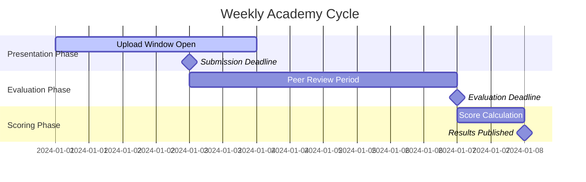

# Peer Academy - Presentation & Evaluation Platform

## Overview

The presentation and evaluation platform is the core engine of the Peer Academy system. Weekly presentations by members drive peer evaluation, which generates the scoring that determines governance roles, representative selection, and community hierarchy. This system must handle multimedia content, real-time evaluation, and complex scoring algorithms.

## Weekly Cycle Management

### Cycle Structure


### Cycle Management System
```typescript
interface AcademyCycle {
  id: string;
  cycleNumber: number;
  year: number;
  startDate: Date;
  submissionDeadline: Date;
  evaluationDeadline: Date;
  resultsPublished: Date;
  status: CycleStatus;
  subjects: SubjectCycle[];
  statistics: CycleStatistics;
}

enum CycleStatus {
  PLANNING = 'planning',
  SUBMISSION_OPEN = 'submission_open',
  EVALUATION_PHASE = 'evaluation_phase',
  SCORING = 'scoring',
  COMPLETED = 'completed',
  CANCELLED = 'cancelled'
}

interface SubjectCycle {
  subjectId: string;
  presentations: Presentation[];
  participationRate: number;
  averageScore: number;
  topPresentationId?: string;
}

class CycleManager {
  async initializeWeeklyCycle(): Promise<AcademyCycle> {
    const currentWeek = this.getCurrentWeekNumber();
    const currentYear = new Date().getFullYear();
    
    // Check if cycle already exists
    const existingCycle = await this.getCycle(currentWeek, currentYear);
    if (existingCycle) {
      return existingCycle;
    }
    
    // Create new cycle
    const cycle: AcademyCycle = {
      id: generateId(),
      cycleNumber: currentWeek,
      year: currentYear,
      startDate: this.getWeekStart(),
      submissionDeadline: this.addDays(this.getWeekStart(), 3),
      evaluationDeadline: this.addDays(this.getWeekStart(), 6),
      resultsPublished: this.addDays(this.getWeekStart(), 7),
      status: CycleStatus.SUBMISSION_OPEN,
      subjects: await this.initializeSubjectCycles(),
      statistics: this.initializeStatistics()
    };
    
    await this.saveCycle(cycle);
    
    // Schedule automatic phase transitions
    this.schedulePhaseTransitions(cycle);
    
    return cycle;
  }
  
  private schedulePhaseTransitions(cycle: AcademyCycle): void {
    // Schedule submission deadline
    scheduleJob(cycle.submissionDeadline, async () => {
      await this.transitionToEvaluationPhase(cycle.id);
    });
    
    // Schedule evaluation deadline
    scheduleJob(cycle.evaluationDeadline, async () => {
      await this.transitionToScoringPhase(cycle.id);
    });
    
    // Schedule results publication
    scheduleJob(cycle.resultsPublished, async () => {
      await this.publishResults(cycle.id);
    });
  }
}
```

## Presentation Management System

### Multi-Media Content Support
```typescript
interface Presentation {
  id: string;
  title: string;
  description: string;
  presenterId: string;
  subjectId: string;
  cycleId: string;
  contentType: ContentType;
  content: PresentationContent;
  metadata: PresentationMetadata;
  evaluations: PresentationEvaluation[];
  status: PresentationStatus;
  createdAt: Date;
  submittedAt?: Date;
  publishedAt?: Date;
}

enum ContentType {
  VIDEO = 'video',
  DOCUMENT = 'document',
  SLIDES = 'slides',
  INTERACTIVE = 'interactive',
  MIXED_MEDIA = 'mixed_media'
}

interface PresentationContent {
  primaryFile: MediaFile;
  supplementaryFiles?: MediaFile[];
  transcript?: string;
  chapters?: ChapterMarker[];
  interactiveElements?: InteractiveElement[];
}

interface MediaFile {
  id: string;
  filename: string;
  url: string;
  thumbnailUrl?: string;
  size: number;
  mimeType: string;
  duration?: number; // for video/audio
  pages?: number; // for documents
  uploadedAt: Date;
  processed: boolean;
}

interface ChapterMarker {
  timestamp: number;
  title: string;
  description?: string;
}

interface InteractiveElement {
  type: 'quiz' | 'poll' | 'annotation' | 'link';
  timestamp?: number; // for video elements
  data: any;
}

enum PresentationStatus {
  DRAFT = 'draft',
  SUBMITTED = 'submitted',
  UNDER_REVIEW = 'under_review',
  PUBLISHED = 'published',
  REJECTED = 'rejected'
}
```

### Upload and Processing Pipeline
```typescript
class PresentationUploadService {
  async uploadPresentation(
    userId: string,
    subjectId: string,
    files: UploadedFile[],
    metadata: PresentationMetadata
  ): Promise<Presentation> {
    
    // Validate upload permissions and cycle status
    await this.validateUpload(userId, subjectId);
    
    // Process files
    const processedFiles = await Promise.all(
      files.map(file => this.processFile(file))
    );
    
    // Create presentation record
    const presentation = await this.createPresentation({
      presenterId: userId,
      subjectId,
      content: {
        primaryFile: processedFiles[0],
        supplementaryFiles: processedFiles.slice(1)
      },
      metadata,
      status: PresentationStatus.DRAFT
    });
    
    // Start background processing
    this.queueBackgroundProcessing(presentation.id);
    
    return presentation;
  }
  
  private async processFile(file: UploadedFile): Promise<MediaFile> {
    // Upload to S3
    const s3Result = await this.s3Service.upload(file);
    
    // Create thumbnail for videos
    let thumbnailUrl: string | undefined;
    if (file.mimetype.startsWith('video/')) {
      thumbnailUrl = await this.createVideoThumbnail(s3Result.url);
    }
    
    // Extract metadata
    const metadata = await this.extractMetadata(file);
    
    return {
      id: generateId(),
      filename: file.originalname,
      url: s3Result.url,
      thumbnailUrl,
      size: file.size,
      mimeType: file.mimetype,
      duration: metadata.duration,
      pages: metadata.pages,
      uploadedAt: new Date(),
      processed: false
    };
  }
  
  private async queueBackgroundProcessing(presentationId: string): Promise<void> {
    // Queue video transcoding
    await this.videoProcessingQueue.add('transcode', { presentationId });
    
    // Queue transcript generation
    await this.transcriptQueue.add('generate', { presentationId });
    
    // Queue content analysis
    await this.contentAnalysisQueue.add('analyze', { presentationId });
  }
}
```

### Content Moderation System
```typescript
class ContentModerationService {
  async moderatePresentation(presentationId: string): Promise<ModerationResult> {
    const presentation = await this.getPresentation(presentationId);
    
    const checks = await Promise.all([
      this.checkContentPolicy(presentation),
      this.checkCopyright(presentation),
      this.checkQualityStandards(presentation),
      this.checkAcademicIntegrity(presentation)
    ]);
    
    const result: ModerationResult = {
      presentationId,
      passed: checks.every(check => check.passed),
      issues: checks.flatMap(check => check.issues),
      score: this.calculateModerationScore(checks),
      actions: this.determineActions(checks)
    };
    
    await this.saveModerationResult(result);
    
    if (!result.passed) {
      await this.notifyPresenter(presentation.presenterId, result);
    }
    
    return result;
  }
  
  private async checkQualityStandards(presentation: Presentation): Promise<ModerationCheck> {
    const issues: string[] = [];
    
    // Check minimum duration for videos
    if (presentation.contentType === ContentType.VIDEO) {
      const duration = presentation.content.primaryFile.duration;
      if (!duration || duration < 300) { // 5 minutes minimum
        issues.push('Video presentations must be at least 5 minutes long');
      }
    }
    
    // Check for minimum content length in documents
    if (presentation.contentType === ContentType.DOCUMENT) {
      const wordCount = await this.getWordCount(presentation.content.primaryFile.url);
      if (wordCount < 1000) {
        issues.push('Document presentations must contain at least 1000 words');
      }
    }
    
    return {
      type: 'quality',
      passed: issues.length === 0,
      issues,
      score: issues.length === 0 ? 100 : Math.max(0, 100 - issues.length * 25)
    };
  }
}

interface ModerationResult {
  presentationId: string;
  passed: boolean;
  issues: string[];
  score: number;
  actions: ModerationAction[];
}

interface ModerationAction {
  type: 'approve' | 'reject' | 'flag' | 'require_revision';
  reason: string;
  autoExecute: boolean;
}
```

## Peer Evaluation System

### Evaluation Interface Design
```typescript
interface PresentationEvaluation {
  id: string;
  presentationId: string;
  evaluatorId: string;
  cycleId: string;
  scores: EvaluationScores;
  feedback: EvaluationFeedback;
  timeSpent: number; // minutes spent evaluating
  votingWeight: number; // evaluator's weight at time of evaluation
  submittedAt: Date;
  isAnonymous: boolean;
}

interface EvaluationScores {
  overall: number; // 1-10 scale
  content: number; // Quality of information presented
  clarity: number; // How well ideas were communicated
  originality: number; // Novelty of insights or approach
  relevance: number; // Relevance to subject matter
  engagement: number; // How engaging the presentation was
}

interface EvaluationFeedback {
  strengths: string;
  improvements: string;
  questions: string;
  publicComments?: string;
  privateNotes?: string;
}

class EvaluationService {
  async submitEvaluation(
    evaluatorId: string,
    presentationId: string,
    evaluation: EvaluationInput
  ): Promise<PresentationEvaluation> {
    
    // Validate evaluator can evaluate this presentation
    await this.validateEvaluationPermissions(evaluatorId, presentationId);
    
    // Get evaluator's current voting weight
    const votingWeight = await this.getVotingWeight(evaluatorId, presentationId);
    
    // Create evaluation record
    const evaluationRecord: PresentationEvaluation = {
      id: generateId(),
      presentationId,
      evaluatorId,
      cycleId: evaluation.cycleId,
      scores: evaluation.scores,
      feedback: evaluation.feedback,
      timeSpent: evaluation.timeSpent,
      votingWeight,
      submittedAt: new Date(),
      isAnonymous: evaluation.isAnonymous ?? true
    };
    
    await this.saveEvaluation(evaluationRecord);
    
    // Update presentation score in real-time
    await this.updatePresentationScore(presentationId);
    
    // Notify presenter (if not anonymous)
    if (!evaluation.isAnonymous) {
      await this.notifyPresenter(presentationId, evaluationRecord);
    }
    
    return evaluationRecord;
  }
  
  private async validateEvaluationPermissions(
    evaluatorId: string,
    presentationId: string
  ): Promise<void> {
    const presentation = await this.getPresentation(presentationId);
    
    // Cannot evaluate own presentation
    if (presentation.presenterId === evaluatorId) {
      throw new Error('Cannot evaluate your own presentation');
    }
    
    // Must be member of same subject
    const evaluator = await this.getUser(evaluatorId);
    const isMember = evaluator.subjectMemberships.some(
      m => m.subjectId === presentation.subjectId && m.isActive
    );
    
    if (!isMember) {
      throw new Error('Must be active member of subject to evaluate presentations');
    }
    
    // Check if already evaluated
    const existingEvaluation = await this.getEvaluation(evaluatorId, presentationId);
    if (existingEvaluation) {
      throw new Error('You have already evaluated this presentation');
    }
    
    // Check evaluation period
    const cycle = await this.getCycle(presentation.cycleId);
    if (cycle.status !== CycleStatus.EVALUATION_PHASE) {
      throw new Error('Evaluation period has closed');
    }
  }
}
```

### Real-time Evaluation Features
```typescript
class LiveEvaluationService {
  private socketService: SocketService;
  
  constructor(socketService: SocketService) {
    this.socketService = socketService;
  }
  
  // Live viewing parties with synchronized evaluation
  async createLiveSession(presentationId: string, hostId: string): Promise<LiveSession> {
    const session: LiveSession = {
      id: generateId(),
      presentationId,
      hostId,
      participants: [hostId],
      currentTimestamp: 0,
      isPlaying: false,
      evaluations: [],
      chat: [],
      createdAt: new Date()
    };
    
    await this.saveLiveSession(session);
    
    // Create socket room
    this.socketService.createRoom(`live-session-${session.id}`);
    
    return session;
  }
  
  async joinLiveSession(sessionId: string, userId: string): Promise<void> {
    const session = await this.getLiveSession(sessionId);
    
    // Add participant
    session.participants.push(userId);
    await this.updateLiveSession(session);
    
    // Join socket room
    this.socketService.joinRoom(userId, `live-session-${sessionId}`);
    
    // Sync current state
    this.socketService.emitToUser(userId, 'live-session:sync', {
      currentTimestamp: session.currentTimestamp,
      isPlaying: session.isPlaying
    });
    
    // Notify other participants
    this.socketService.emitToRoom(`live-session-${sessionId}`, 'participant:joined', {
      userId,
      participantCount: session.participants.length
    });
  }
  
  // Real-time collaborative annotation
  async addAnnotation(
    sessionId: string,
    userId: string,
    annotation: Annotation
  ): Promise<void> {
    const session = await this.getLiveSession(sessionId);
    
    const annotationWithId = {
      ...annotation,
      id: generateId(),
      userId,
      createdAt: new Date()
    };
    
    session.annotations = session.annotations || [];
    session.annotations.push(annotationWithId);
    
    await this.updateLiveSession(session);
    
    // Broadcast to all participants
    this.socketService.emitToRoom(`live-session-${sessionId}`, 'annotation:added', annotationWithId);
  }
}

interface LiveSession {
  id: string;
  presentationId: string;
  hostId: string;
  participants: string[];
  currentTimestamp: number;
  isPlaying: boolean;
  evaluations: LiveEvaluation[];
  chat: ChatMessage[];
  annotations?: Annotation[];
  createdAt: Date;
}

interface Annotation {
  id?: string;
  timestamp: number;
  type: 'comment' | 'question' | 'highlight';
  content: string;
  userId?: string;
  createdAt?: Date;
}
```

## Scoring and Ranking Integration

### Real-time Score Calculation
```typescript
class ScoringEngine {
  async calculatePresentationScore(presentationId: string): Promise<number> {
    const evaluations = await this.getEvaluations(presentationId);
    
    if (evaluations.length === 0) return 0;
    
    // Calculate weighted average
    const totalWeight = evaluations.reduce((sum, eval) => sum + eval.votingWeight, 0);
    const weightedSum = evaluations.reduce((sum, eval) => {
      const overallScore = eval.scores.overall;
      return sum + (overallScore * eval.votingWeight);
    }, 0);
    
    const baseScore = weightedSum / totalWeight;
    
    // Apply quality multipliers
    const qualityMultiplier = await this.calculateQualityMultiplier(presentationId);
    const engagementMultiplier = await this.calculateEngagementMultiplier(presentationId);
    
    const finalScore = baseScore * qualityMultiplier * engagementMultiplier;
    
    // Update presentation record
    await this.updatePresentationScore(presentationId, finalScore);
    
    // Update presenter's cumulative score
    await this.updatePresenterScore(presentationId, finalScore);
    
    return finalScore;
  }
  
  private async calculateQualityMultiplier(presentationId: string): Promise<number> {
    const evaluations = await this.getEvaluations(presentationId);
    
    // Higher multiplier for presentations with consistent high scores across categories
    const avgScores = {
      content: 0,
      clarity: 0,
      originality: 0,
      relevance: 0,
      engagement: 0
    };
    
    evaluations.forEach(eval => {
      avgScores.content += eval.scores.content;
      avgScores.clarity += eval.scores.clarity;
      avgScores.originality += eval.scores.originality;
      avgScores.relevance += eval.scores.relevance;
      avgScores.engagement += eval.scores.engagement;
    });
    
    Object.keys(avgScores).forEach(key => {
      avgScores[key] /= evaluations.length;
    });
    
    // Consistency bonus - lower standard deviation = higher multiplier
    const scores = Object.values(avgScores);
    const variance = this.calculateVariance(scores);
    const consistencyBonus = Math.max(0, 1 - (variance / 10)); // 0-1 bonus
    
    return 1 + (consistencyBonus * 0.2); // Up to 20% bonus
  }
  
  private async calculateEngagementMultiplier(presentationId: string): Promise<number> {
    const presentation = await this.getPresentation(presentationId);
    const subject = await this.getSubject(presentation.subjectId);
    
    // Engagement based on evaluation participation rate
    const totalMembers = subject.members.filter(m => m.isActive).length;
    const evaluationCount = presentation.evaluations.length;
    const participationRate = evaluationCount / Math.max(totalMembers - 1, 1); // -1 for presenter
    
    // Bonus for high participation
    return 1 + (participationRate * 0.3); // Up to 30% bonus
  }
}
```

### Advanced Analytics
```typescript
class PresentationAnalytics {
  async generatePresentationAnalytics(presentationId: string): Promise<PresentationAnalytics> {
    const presentation = await this.getPresentation(presentationId);
    const evaluations = await this.getEvaluations(presentationId);
    
    return {
      presentationId,
      totalViews: await this.getViewCount(presentationId),
      evaluationCount: evaluations.length,
      averageScore: this.calculateAverageScore(evaluations),
      scoreDistribution: this.calculateScoreDistribution(evaluations),
      feedbackSentiment: await this.analyzeFeedbackSentiment(evaluations),
      engagementMetrics: await this.calculateEngagementMetrics(presentationId),
      comparison: await this.generateSubjectComparison(presentation.subjectId, presentationId)
    };
  }
  
  private calculateScoreDistribution(evaluations: PresentationEvaluation[]): ScoreDistribution {
    const categories = ['content', 'clarity', 'originality', 'relevance', 'engagement'];
    const distribution: ScoreDistribution = {};
    
    categories.forEach(category => {
      const scores = evaluations.map(eval => eval.scores[category]);
      distribution[category] = {
        average: scores.reduce((a, b) => a + b, 0) / scores.length,
        median: this.calculateMedian(scores),
        standardDeviation: this.calculateStandardDeviation(scores),
        histogram: this.createHistogram(scores, 10) // 10 bins
      };
    });
    
    return distribution;
  }
  
  private async analyzeFeedbackSentiment(evaluations: PresentationEvaluation[]): Promise<SentimentAnalysis> {
    const feedbacks = evaluations
      .map(eval => `${eval.feedback.strengths} ${eval.feedback.improvements}`)
      .filter(text => text.trim().length > 0);
    
    if (feedbacks.length === 0) {
      return { overall: 'neutral', confidence: 0, details: [] };
    }
    
    // Simple sentiment analysis (in production, use proper NLP service)
    const positiveWords = ['excellent', 'great', 'outstanding', 'clear', 'engaging', 'insightful'];
    const negativeWords = ['poor', 'unclear', 'boring', 'confusing', 'weak', 'lacking'];
    
    let positiveCount = 0;
    let negativeCount = 0;
    
    feedbacks.forEach(feedback => {
      const lowerFeedback = feedback.toLowerCase();
      positiveWords.forEach(word => {
        if (lowerFeedback.includes(word)) positiveCount++;
      });
      negativeWords.forEach(word => {
        if (lowerFeedback.includes(word)) negativeCount++;
      });
    });
    
    const total = positiveCount + negativeCount;
    if (total === 0) return { overall: 'neutral', confidence: 0, details: [] };
    
    const sentiment = positiveCount > negativeCount ? 'positive' : 
                     negativeCount > positiveCount ? 'negative' : 'neutral';
    const confidence = Math.abs(positiveCount - negativeCount) / total;
    
    return {
      overall: sentiment,
      confidence,
      details: [
        { category: 'positive', count: positiveCount },
        { category: 'negative', count: negativeCount }
      ]
    };
  }
}
```

## Database Schema

### Presentation Tables
```sql
-- Presentation cycles
CREATE TABLE presentation_cycles (
  id UUID PRIMARY KEY DEFAULT gen_random_uuid(),
  cycle_number INTEGER NOT NULL,
  year INTEGER NOT NULL,
  start_date TIMESTAMP NOT NULL,
  submission_deadline TIMESTAMP NOT NULL,
  evaluation_deadline TIMESTAMP NOT NULL,
  results_published TIMESTAMP,
  status VARCHAR(20) DEFAULT 'submission_open',
  created_at TIMESTAMP DEFAULT CURRENT_TIMESTAMP,
  
  UNIQUE(cycle_number, year)
);

-- Presentations
CREATE TABLE presentations (
  id UUID PRIMARY KEY DEFAULT gen_random_uuid(),
  title VARCHAR(500) NOT NULL,
  description TEXT,
  presenter_id UUID REFERENCES users(id) ON DELETE CASCADE,
  subject_id UUID REFERENCES subjects(id) ON DELETE CASCADE,
  cycle_id UUID REFERENCES presentation_cycles(id) ON DELETE CASCADE,
  content_type VARCHAR(50) NOT NULL,
  primary_file_url VARCHAR(1000) NOT NULL,
  thumbnail_url VARCHAR(1000),
  transcript TEXT,
  metadata JSONB,
  status VARCHAR(20) DEFAULT 'draft',
  total_score DECIMAL(5,2) DEFAULT 0,
  view_count INTEGER DEFAULT 0,
  created_at TIMESTAMP DEFAULT CURRENT_TIMESTAMP,
  submitted_at TIMESTAMP,
  published_at TIMESTAMP
);

-- Presentation evaluations
CREATE TABLE presentation_evaluations (
  id UUID PRIMARY KEY DEFAULT gen_random_uuid(),
  presentation_id UUID REFERENCES presentations(id) ON DELETE CASCADE,
  evaluator_id UUID REFERENCES users(id) ON DELETE CASCADE,
  cycle_id UUID REFERENCES presentation_cycles(id) ON DELETE CASCADE,
  score_overall INTEGER CHECK (score_overall >= 1 AND score_overall <= 10),
  score_content INTEGER CHECK (score_content >= 1 AND score_content <= 10),
  score_clarity INTEGER CHECK (score_clarity >= 1 AND score_clarity <= 10),
  score_originality INTEGER CHECK (score_originality >= 1 AND score_originality <= 10),
  score_relevance INTEGER CHECK (score_relevance >= 1 AND score_relevance <= 10),
  score_engagement INTEGER CHECK (score_engagement >= 1 AND score_engagement <= 10),
  feedback_strengths TEXT,
  feedback_improvements TEXT,
  feedback_questions TEXT,
  public_comments TEXT,
  private_notes TEXT,
  voting_weight DECIMAL(8,2) NOT NULL,
  time_spent INTEGER, -- minutes
  is_anonymous BOOLEAN DEFAULT TRUE,
  submitted_at TIMESTAMP DEFAULT CURRENT_TIMESTAMP,
  
  UNIQUE(presentation_id, evaluator_id)
);

-- Live sessions
CREATE TABLE live_sessions (
  id UUID PRIMARY KEY DEFAULT gen_random_uuid(),
  presentation_id UUID REFERENCES presentations(id) ON DELETE CASCADE,
  host_id UUID REFERENCES users(id) ON DELETE CASCADE,
  participants JSONB NOT NULL DEFAULT '[]',
  current_timestamp INTEGER DEFAULT 0,
  is_playing BOOLEAN DEFAULT FALSE,
  annotations JSONB DEFAULT '[]',
  created_at TIMESTAMP DEFAULT CURRENT_TIMESTAMP,
  ended_at TIMESTAMP
);

-- Indexes for performance
CREATE INDEX idx_presentations_subject_cycle ON presentations(subject_id, cycle_id);
CREATE INDEX idx_presentations_presenter ON presentations(presenter_id);
CREATE INDEX idx_presentations_score ON presentations(total_score DESC);
CREATE INDEX idx_evaluations_presentation ON presentation_evaluations(presentation_id);
CREATE INDEX idx_evaluations_evaluator ON presentation_evaluations(evaluator_id);
CREATE INDEX idx_cycles_year_number ON presentation_cycles(year, cycle_number);
```

This presentation and evaluation platform provides the sophisticated peer review system needed to drive the merit-based governance structure of Peer Academy, with real-time features, quality controls, and comprehensive analytics.