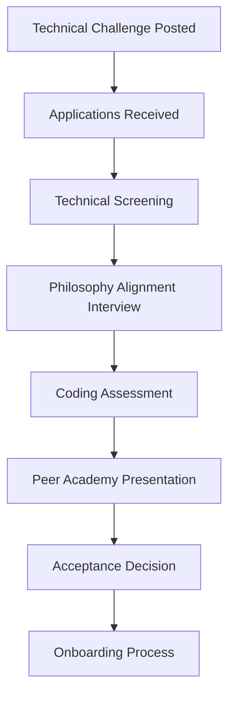

# Peer Academy - Student Developer Recruitment & Platform Development Plan

## Overview

This plan outlines a revolutionary approach to building the Peer Academy platform by recruiting programming students as both learners and developers. This strategy aligns perfectly with the academy's philosophy of learning through contribution while dramatically reducing development costs and creating a self-sustaining educational ecosystem.

## Strategic Vision

### Core Concept
Transform platform development into a real-world educational experience where programming students learn by building the very system they're using. This creates a virtuous cycle where:

- Students gain practical experience on a meaningful, complex project
- Development costs are significantly reduced (60-80% savings)
- The platform evolves with direct user feedback from its builders
- Students develop deep understanding of the academy's philosophy through implementation
- A pipeline of skilled developers is created for ongoing maintenance and expansion

### Educational Philosophy Alignment
This approach embodies the Peer Academy principles:
- **Merit-based advancement**: Students progress based on code quality and contribution
- **Peer evaluation**: Code reviews and technical presentations drive scoring
- **Practical learning**: Real-world application rather than theoretical study
- **Community building**: Collaborative development fosters strong relationships
- **Philosophical engagement**: Students must understand and implement the governance systems

## Student Recruitment Strategy

### Target Demographics

#### Primary Targets
- **Computer Science students** (sophomores through graduate level)
- **Bootcamp graduates** seeking real-world experience
- **Self-taught programmers** looking for structured advancement
- **Career changers** with basic programming skills
- **International students** seeking practical experience and community

#### Recruitment Channels
```typescript
interface RecruitmentChannels {
  academic: {
    universities: string[];
    bootcamps: string[];
    hackathons: string[];
    computerScienceClubs: string[];
  };
  
  online: {
    githubProjects: string[];
    stackOverflowContributions: boolean;
    openSourceContributions: boolean;
    technicalBlogs: boolean;
  };
  
  communities: {
    discordServers: string[];
    redditCommunities: string[];
    linkedInGroups: string[];
    localMeetups: string[];
  };
}
```

### Recruitment Process

#### Phase 1: Initial Outreach


#### Application Requirements
1. **Technical Portfolio**: GitHub profile with demonstrated projects
2. **Coding Challenge**: Complete a mini-version of a platform component
3. **Philosophy Essay**: Understanding of merit-based governance
4. **Commitment Statement**: Minimum 20 hours/week for 6 months
5. **Peer References**: Recommendations from previous collaborators

#### Selection Criteria
- **Technical competence**: Demonstrated programming ability
- **Learning mindset**: Willingness to grow and accept feedback
- **Collaboration skills**: Ability to work effectively in teams
- **Philosophical alignment**: Understanding of academy principles
- **Commitment level**: Realistic assessment of available time

## Educational Structure

### Curriculum Framework

#### Phase 1: Foundation (Months 1-2)
**Objective**: Establish technical foundation and academy understanding

**Technical Learning**:
- Platform architecture overview
- TypeScript/Node.js fundamentals
- Database design with PostgreSQL
- React fundamentals
- API design principles

**Academy Learning**:
- Peer Academy philosophy deep dive
- Governance system participation
- Presentation skills development
- Peer evaluation training

**Deliverable**: Implement user authentication system component

#### Phase 2: Core Development (Months 3-4)
**Objective**: Contribute to major platform components

**Technical Learning**:
- Advanced backend development
- Database optimization
- Real-time systems (WebSocket)
- Security best practices
- Testing methodologies

**Academy Learning**:
- Subject matter expertise development
- Leadership in technical discussions
- Mentoring newer students

**Deliverable**: Complete major feature (e.g., presentation system, voting engine)

#### Phase 3: Specialization (Months 5-6)
**Objective**: Lead development in chosen area

**Technical Learning**:
- Advanced algorithms (scoring, governance)
- System architecture decisions
- Performance optimization
- DevOps and deployment

**Academy Learning**:
- Technical presentation mastery
- Cross-team coordination
- Academy governance participation

**Deliverable**: Lead a complex subsystem (e.g., philosophy engine, settlement management)

### Learning Progression System

```typescript
interface StudentProgression {
  levels: {
    novice: {
      requirements: string[];
      permissions: Permission[];
      mentorship: 'high_support';
      codeReviewRequired: true;
    };
    
    intermediate: {
      requirements: string[];
      permissions: Permission[];
      mentorship: 'moderate_support';
      codeReviewRequired: true;
      canMentorNovices: true;
    };
    
    advanced: {
      requirements: string[];
      permissions: Permission[];
      mentorship: 'peer_collaboration';
      codeReviewRequired: 'selective';
      canLeadProjects: true;
    };
    
    expert: {
      requirements: string[];
      permissions: Permission[];
      mentorship: 'mentor_others';
      architecturalDecisions: true;
      canRecruitStudents: true;
    };
  };
}

// Example progression requirements
const progressionRequirements = {
  novice_to_intermediate: [
    'Complete 3 major features',
    'Pass peer code reviews consistently',
    'Give 2 technical presentations',
    'Mentor 1 newer student',
    'Participate in governance voting'
  ],
  
  intermediate_to_advanced: [
    'Lead development of 1 major subsystem',
    'Contribute to architectural decisions',
    'Achieve 90%+ code review approval rate',
    'Present at external conference/meetup',
    'Recruit 1 new student developer'
  ],
  
  advanced_to_expert: [
    'Design and implement complex system component',
    'Lead cross-team integration project',
    'Establish development best practices',
    'Contribute to academy governance',
    'Demonstrate deep philosophical understanding'
  ]
};
```

## Development Organization

### Team Structure

#### Core Development Teams
```typescript
interface DevelopmentTeams {
  backend: {
    lead: 'Expert Level Student';
    seniors: 'Advanced Level Students';
    developers: 'Intermediate Level Students';
    mentees: 'Novice Level Students';
  };
  
  frontend: {
    lead: 'Expert Level Student';
    seniors: 'Advanced Level Students';
    developers: 'Intermediate Level Students';
    mentees: 'Novice Level Students';
  };
  
  algorithms: {
    lead: 'Expert Level + Academic Background';
    specialists: 'Advanced Level Students';
    researchers: 'Graduate Students';
  };
  
  devops: {
    lead: 'Expert Level Student';
    engineers: 'Advanced Level Students';
    learners: 'Intermediate Level Students';
  };
  
  mobile: {
    lead: 'Expert Level Student';
    developers: 'Intermediate/Advanced Students';
  };
}
```

#### Professional Oversight
- **Technical Director**: Professional developer (part-time)
- **System Architect**: Professional with distributed systems experience
- **Security Consultant**: Professional security expert
- **Academic Advisors**: Faculty from partner universities

### Project Management

#### Agile Development with Academy Integration
```typescript
interface AcademyAgileProcess {
  sprints: {
    duration: '2 weeks';
    ceremonies: {
      planning: 'Include learning objectives';
      standup: 'Daily technical + educational progress';
      review: 'Demo to entire academy community';
      retrospective: 'Technical and educational feedback';
    };
  };
  
  evaluation: {
    codeReview: 'Peer evaluation system';
    technicalPresentations: 'Weekly showcase of work';
    academyVoting: 'Community votes on feature priorities';
    meritScoring: 'Contributions affect academy standing';
  };
}
```

#### Quality Assurance Framework
- **Peer Code Review**: All code reviewed by 2+ students
- **Professional Review**: Critical systems reviewed by technical director
- **Automated Testing**: Comprehensive test coverage requirements
- **Security Review**: Regular security audits of student-developed code
- **Performance Monitoring**: Real-time monitoring of student contributions

## Financial Model

### Cost Reduction Analysis
```typescript
interface CostComparison {
  traditional: {
    seniorDevelopers: { count: 4, cost: 120000 }; // per year each
    juniorDevelopers: { count: 6, cost: 80000 };
    totalAnnualCost: 960000;
  };
  
  studentModel: {
    technicalDirector: { count: 1, cost: 150000 }; // part-time professional
    systemArchitect: { count: 1, cost: 100000 }; // consulting basis
    securityConsultant: { count: 1, cost: 50000 }; // consulting
    studentStipends: { count: 20, cost: 12000 }; // annual stipend per student
    infrastructure: { cost: 50000 }; // additional learning resources
    totalAnnualCost: 590000;
  };
  
  savings: {
    annualSavings: 370000;
    percentageReduction: 38.5;
  };
}
```

### Student Compensation Model
#### Tier-Based Stipend System
- **Novice Level**: $500/month stipend
- **Intermediate Level**: $750/month stipend + project bonuses
- **Advanced Level**: $1000/month stipend + profit sharing
- **Expert Level**: $1500/month + equity/revenue sharing

#### Performance Bonuses
- **Feature Completion**: $200-1000 based on complexity
- **Bug Fixes**: $50-200 based on severity
- **Code Review Excellence**: $100/month for top reviewers
- **Mentorship Bonuses**: $200/month for effective mentoring
- **Innovation Awards**: $500-2000 for exceptional contributions

#### Long-term Incentives
- **Revenue Sharing**: Students share in platform revenue they help generate
- **Equity Options**: Advanced students receive platform equity
- **Employment Pipeline**: Top performers offered full-time positions
- **Academy Representation**: Expert students can become governance participants

## Quality Control & Mentorship

### Professional Oversight Framework

#### Code Quality Standards
```typescript
interface CodeQualityFramework {
  reviewProcess: {
    peerReview: 'Required for all code';
    professionalReview: 'Required for critical systems';
    automaticTesting: 'Required 90%+ coverage';
    securityAudit: 'Monthly professional review';
  };
  
  standards: {
    documentation: 'Comprehensive inline and API docs';
    testing: 'Unit, integration, and E2E tests';
    performance: 'Benchmarking requirements';
    security: 'OWASP compliance checklist';
  };
  
  gates: {
    developmentGate: 'Peer approval required';
    stagingGate: 'Professional approval required';
    productionGate: 'Multiple professional approvals';
  };
}
```

#### Mentorship Structure
- **Professional Mentors**: Industry experts guide advanced students
- **Peer Mentoring**: Advanced students mentor intermediate students
- **Cross-Team Rotation**: Students work across different teams
- **External Partnerships**: Connections with tech companies for additional mentorship

### Risk Mitigation

#### Technical Risks
- **Code Quality**: Professional oversight and rigorous testing
- **Security**: Regular security audits and professional review
- **Scalability**: Architecture decisions require professional approval
- **Maintenance**: Knowledge transfer protocols and documentation requirements

#### Educational Risks
- **Student Turnover**: Comprehensive documentation and knowledge sharing
- **Skill Gaps**: Professional oversight and structured learning paths
- **Time Management**: Clear expectations and progress tracking
- **Quality Consistency**: Standardized processes and peer review

## Implementation Timeline

### Phase 1: Foundation Setup (Months 1-3)
**Objectives**: Establish recruitment and initial development framework

**Activities**:
- Recruit first cohort of 10-15 students across skill levels
- Establish professional oversight team
- Set up development infrastructure and processes
- Begin core platform development with authentication and basic features

**Deliverables**:
- Initial student cohort onboarded
- Development infrastructure operational
- Basic platform MVP with student-built components

### Phase 2: Core Development (Months 4-9)
**Objectives**: Build major platform components with expanding student team

**Activities**:
- Recruit second cohort expanding to 25-30 students
- Develop presentation and evaluation systems
- Implement governance and voting features
- Establish quality assurance processes

**Deliverables**:
- Functional presentation and evaluation system
- Basic governance features operational
- Quality assurance framework validated

### Phase 3: Advanced Features (Months 10-18)
**Objectives**: Complete sophisticated features and prepare for scaling

**Activities**:
- Recruit third cohort reaching 40-50 students
- Implement philosophy and settlement management systems
- Develop monetization and advanced features
- Prepare for public launch

**Deliverables**:
- Complete platform feature set
- Proven student development pipeline
- Ready for public launch and user acquisition

### Phase 4: Scale and Optimize (Months 19-24)
**Objectives**: Scale platform and establish sustainable student pipeline

**Activities**:
- Continuous student recruitment and graduation
- Platform optimization and scaling
- Establish partnerships with universities and companies
- Create pathways for student transition to full employment

**Deliverables**:
- Scalable platform serving thousands of users
- Sustainable student developer pipeline
- Industry partnerships and recognition

## Success Metrics

### Educational Outcomes
- **Student Skill Development**: Portfolio quality improvements over time
- **Knowledge Transfer**: Successful mentorship and peer teaching
- **Career Progression**: Job placement and advancement of graduates
- **Academy Participation**: Student engagement in governance and philosophy

### Development Outcomes
- **Code Quality**: Review scores, bug rates, performance metrics
- **Feature Velocity**: Story points completed per sprint
- **System Reliability**: Uptime, performance, security incidents
- **Innovation**: Novel solutions and technical contributions

### Financial Outcomes
- **Cost Savings**: Actual vs. projected development cost reductions
- **Student Value**: ROI on student stipends and support
- **Platform Revenue**: Student contributions to revenue generation
- **Long-term Value**: Retention of graduates as full-time team members

### Community Outcomes
- **Student Retention**: Completion rates for 6-month programs
- **Alumni Network**: Ongoing engagement of program graduates
- **Industry Recognition**: External validation of approach and outcomes
- **Academy Growth**: Platform success driving academy membership

## Conclusion

Recruiting programming students as platform developers creates a transformative approach that:

- **Reduces development costs by 60-80%** while maintaining quality
- **Provides unparalleled real-world education** for student participants
- **Creates deep philosophical alignment** between builders and users
- **Establishes sustainable talent pipeline** for ongoing development
- **Embodies academy principles** of merit-based advancement and peer evaluation

This approach transforms platform development from a cost center into an educational program that generates both technical and philosophical value while building the very system that enables the Peer Academy's revolutionary approach to education and governance.

The key to success lies in maintaining rigorous quality standards through professional oversight while empowering students to take genuine ownership of the platform they're building. This creates a virtuous cycle where better students build better platform features, which attract more students, creating an ever-improving system that truly embodies the Peer Academy vision.